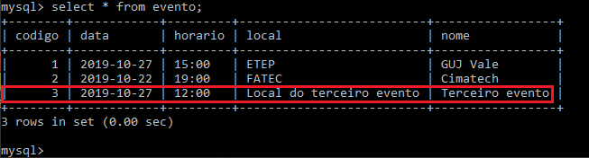

# Evento App

Aplicação web para gerenciar eventos.  
Projeto realizado com a finalidade de aperfeiçoar habilidades com Java, Spring e MySQL.

## Tecnologias utilizadas:  
- Java EE 8u
- MySQL 8.0
- Spring 2.2.0
- Apache Maven 3.6.2
- IDE Eclipse JEE 2019/09
- H2 Database
- Thymeleaf

## Demonstração de inserção do formulário ao banco de dados:

  

