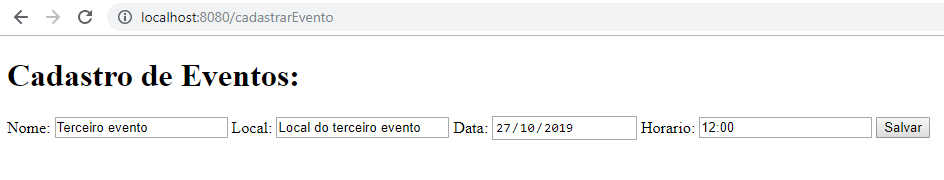

# Evento App

Aplicação web para gerenciar eventos.  
Projeto realizado com a finalidade de aperfeiçoar habilidades com Java, Spring e MySQL.
  
## Tecnologias utilizadas  
- Java EE 8u
- MySQL 8.0
- Spring boot 2.2.0
-- Spring MVC
- Apache Maven 3.6.2
- IDE Eclipse JEE 2019/09
- H2 Database
- Thymeleaf
  
## Demonstração de inserção do formulário ao banco de dados

  
  
  
## Dependências utilizadas no pom.xml
```
<dependencies>
           <dependency>
		<groupId>org.springframework.boot</groupId>
		<artifactId>spring-boot-starter-thymeleaf</artifactId>
	</dependency>
	<dependency>
		<groupId>org.springframework.boot</groupId>
		<artifactId>spring-boot-starter-web</artifactId>
	</dependency>
	<dependency>
		<groupId>org.springframework.boot</groupId>
		<artifactId>spring-boot-devtools</artifactId>
		<scope>runtime</scope>
		<optional>true</optional>
	</dependency>
	<dependency>
		<groupId>org.springframework.boot</groupId>
		<artifactId>spring-boot-starter-test</artifactId>
		<scope>test</scope>
		<exclusions>
			<exclusion>
				<groupId>org.junit.vintage</groupId>
				<artifactId>junit-vintage-engine</artifactId>
			</exclusion>
		</exclusions>
	</dependency>
	<dependency>
		<groupId>org.springframework.boot</groupId>
		<artifactId>spring-boot-starter-data-jpa</artifactId>
	</dependency>
	<dependency>
		<groupId>mysql</groupId>
		<artifactId>mysql-connector-java</artifactId>
		<version>8.0.18</version>
           	<scope>compile</scope>
	</dependency>
	<dependency>
 		 <groupId>com.h2database</groupId>
  		 <artifactId>h2</artifactId>
  		 </dependency>
</dependencies>
```
  
## Templates utilizados através do thymeleaf  
### Index:
```
<html>
	<body>
		<h3>Olá mundo.</h3>
		<h3>Teste Spring.</h3>
	</body>
</html>
```
  
### Formulário para cadastro de eventos:
```
<!DOCTYPE html>		
<html xmlns:th="http://thymeleaf.org"
		xmlns:layout="http://www.ultraq.net.nz/thymeleaf/layout">	
	<head>
		<title>EventosApp</title>
	</head>
	
	<body>
		<h1>Cadastro de Eventos:</h1>
		<form method="post">
		Nome: <input type="text" value="" name="nome"/>	
		Local: <input type="text" value="" name="local"/>
		Data: <input type="date" value="" name="data"/>
		Horario: <input type="text" value="" name="horario"/>
		
		<button type="submit">Salvar</button>
		</form>
	</body>
</html>
```
